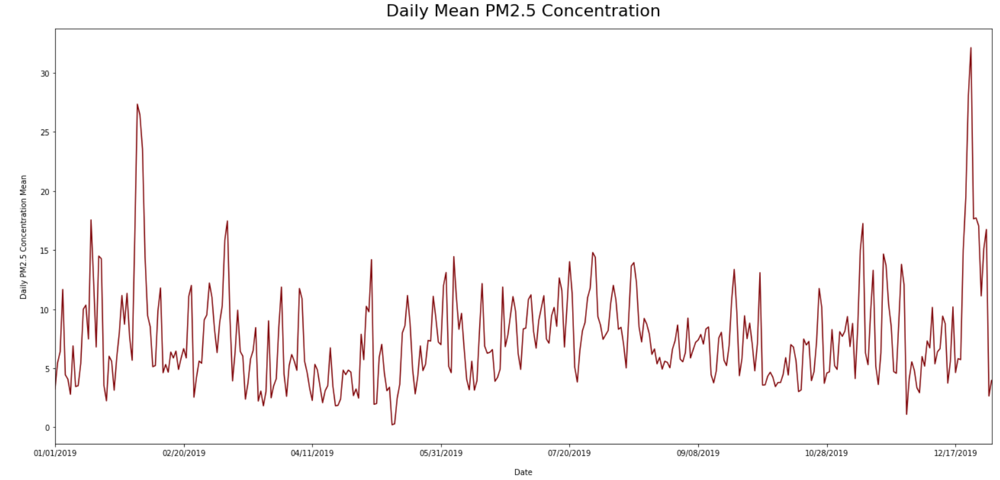
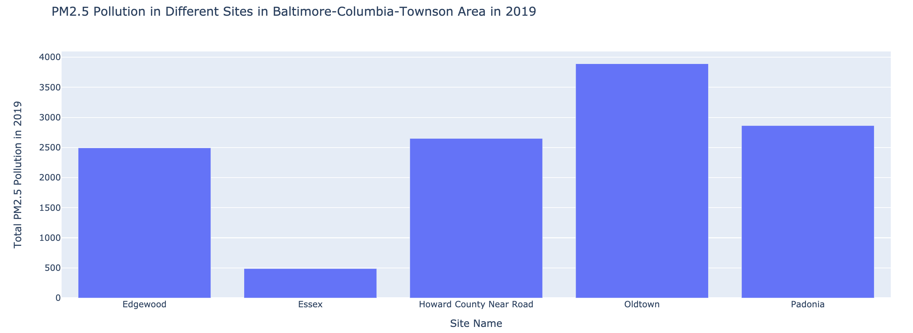

# Baltimore-Columbia-Towson_PM2.5_Pollution_2019
### Description
In 2019, Wheelabrator (the incineration plant in Baltimore) sued Baltimore government for: 1.not providing enough trash as stated in the contract; 2.enforcing a air contorl regulation that was too strict to be adapted within the given time. First of all, it's true, sadly, that we need incineration plant to burn a decent amount of trash for us, because otherwise they would go directly into landfills, which is worse for the environment. However, incineration contributing to a large amount of the air pollution. Thus, we still need to be aware of the air quality issue and make sure that it's within a safe range. This analysis focuses on the PM2.5 concentration in different sites in Baltimore-Columnbia-Towson in the year 2019. Here are the Date based and Site based Pm2.5 concentration charts:

### Research Results
Research questions:
* How is the air quality across all sites changes **throughout the year**?
* How is the air quality of **each site** in 2019?
I used python for the data analysis. First, I retrieved data from [United States Environmental Protection Agency](https://www.epa.gov/outdoor-air-quality-data/download-daily-data) and uploaded it in Github. Atfer that, I used Google code to plug in the data and create two pivot tables from the original [csv file](ad_viz_plotval_data.csv). Finally, two charts are plotted.
### Reference
* [United States Environmental Protection Agency](https://www.epa.gov/outdoor-air-quality-data/download-daily-data)
* [Formatting Sheet](https://github.com/adam-p/markdown-here/wiki/Markdown-Cheatsheet)
